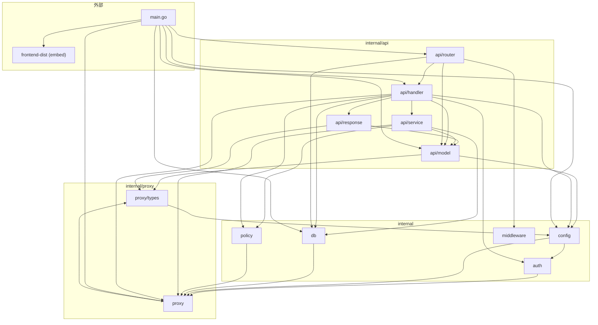
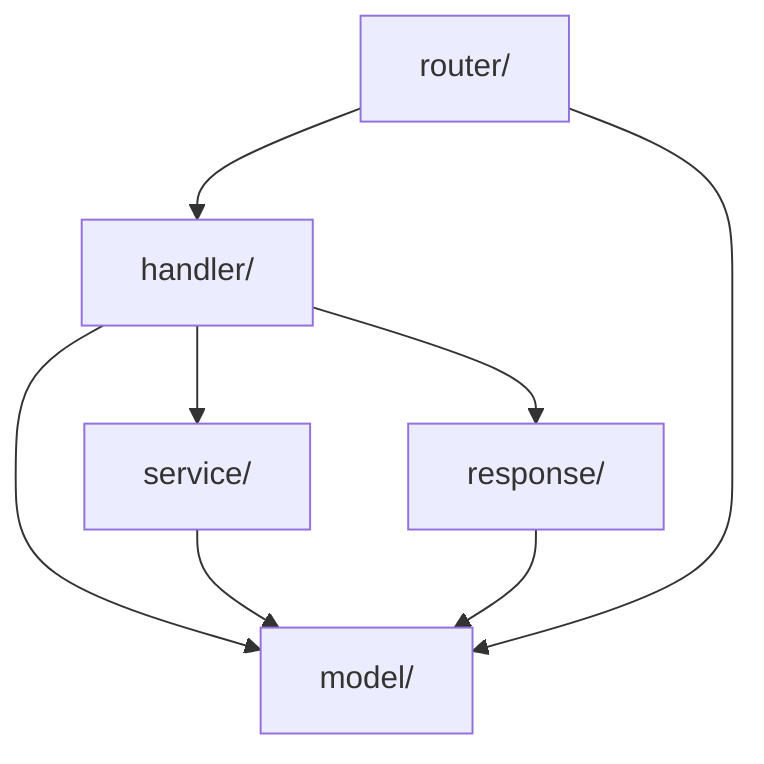
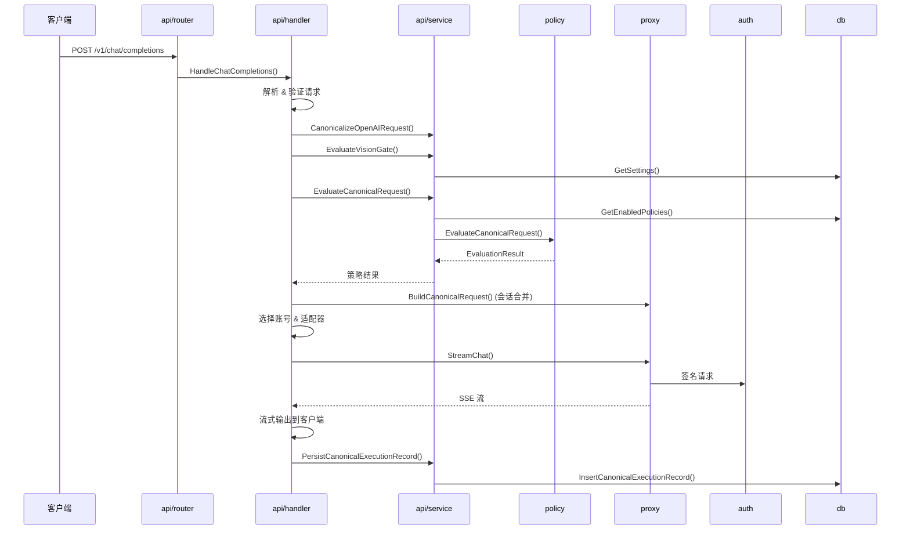

# lingma2api 架构文档

## 项目总览

`lingma2api` 是一个 Go 服务，内嵌 Vite/React 管理控制台。它将灵码（Lingma）后端封装为兼容 OpenAI / Anthropic 协议的 API，支持多区域、多账号负载均衡和运行时策略评估。

## 包结构

```
internal/
├── api/           # HTTP 层（本次重构后）
│   ├── model/     # 类型定义、接口、Dependencies 容器
│   ├── handler/   # HTTP 处理器（Server 及其方法）
│   ├── router/    # 路由注册
│   ├── service/   # 业务逻辑（策略评估、持久化、Vision 门控、交换日志）
│   └── response/  # 响应写入工具函数
├── auth/          # 认证模块
├── config/        # 配置系统
├── db/            # 持久化层（SQLite）
├── middleware/    # HTTP 中间件
├── policy/        # 策略引擎
└── proxy/         # 核心代理层
```

## 各包职责

### `internal/api/` — HTTP 层

重构后的 HTTP 层拆分为 5 个子包，职责清晰：

| 子包 | 职责 |
|------|------|
| `model/` | 所有接口定义（`CredentialProvider`、`ModelService`、`SessionStore` 等 15 个接口）、`Dependencies` 依赖注入容器、OpenAI/Anthropic 响应类型、错误哨兵 |
| `handler/` | `Server` 结构体及其所有 HTTP 处理方法，按文件分隔：`chat.go`（Chat 核心+SSE）、`anthropic.go`（Anthropic 消息）、`admin_core.go`/`admin_extended.go`（管理端点）、`bootstrap_*.go`（OAuth 引导流程）等 |
| `router/` | `router.New()` 函数 — 创建 `Server`，注册全部路由，配置前端文件服务和日志中间件 |
| `service/` | 从 handler 解耦出的纯业务逻辑：`canonical.go`（策略评估+执行记录持久化）、`vision.go`（Vision 门控）、`exchange.go`（HTTP 交换日志） |
| `response/` | 14 个响应写入工具函数，覆盖 OpenAI 和 Anthropic 两种协议的 JSON/SSE 输出 |

依赖方向：`router` → `handler` → `service`/`response` → `model`，无循环依赖。

### `internal/auth/` — 认证模块

处理灵码 OAuth 完整生命周期：
- 构造 PKCE 登录 URL
- 启动本地 HTTP 回调服务器捕获 OAuth 重定向
- 将回调参数转换为凭据（CosyKey + EncryptUserInfo）
- 通过 WebSocket JSON-RPC 桥接本地灵码二进制文件
- AES-128-CBC 加解密缓存/用户文件

关键导出：`BuildLingmaLoginEntryURL`、`WaitForCallbackWithOptions`、`DeriveCredentialsWithLingma`、`ParseCallbackV2FromURL`

### `internal/config/` — 配置系统

解析类 YAML 配置文件，合并默认值。顶层 `Config` 结构体包含 6 个子配置：

| 子配置 | 用途 |
|--------|------|
| `ServerConfig` | 监听地址、端口、Admin Token |
| `CredentialConfig` | 凭据文件路径 |
| `SessionConfig` | 会话 TTL、最大会话数 |
| `LingmaConfig` | 灵码后端 URL、Cosy 版本、OAuth 回调地址 |
| `AccountConfig` | 多账号路由模式、负载均衡策略、区域 Base URL |
| `LoggingConfig` | 执行日志开关 |

### `internal/db/` — 持久化层

基于 SQLite 的数据存储，自动迁移 schema：

| 表/概念 | 用途 |
|---------|------|
| `policy_rules` | 策略规则 CRUD（匹配条件 + 执行动作） |
| `request_logs` | 请求日志 |
| `canonical_execution_records` | 规范化执行记录（含前后策略快照和 SSE 原始行） |
| `http_exchanges` | HTTP 请求/响应交换记录 |
| `model_mappings` | 模型别名映射 |
| `settings` | 键值对设置存储 |

### `internal/middleware/` — 中间件

请求日志拦截中间件（已弃用）。当前由 `api/service/canonical.go` 的规范化管道替代，仅在路由层保留透传兼容。

### `internal/policy/` — 策略引擎

运行时策略评估引擎：

- 输入：数据库中的规则列表 + `CanonicalRequest` 属性
- 匹配条件：协议、请求模型、Stream、Tools、Reasoning、Session、ClientName、IngressTag
- 执行动作：模型重写、推理/工具/标签开关
- 规则按优先级排序，遵循"先匹配先得"原则，带抑制跟踪

### `internal/proxy/` — 核心代理层

整个应用的心脏，109 个文件，承担以下职责：

| 职责 | 说明 |
|------|------|
| **协议转换** | OpenAI Chat Completions ↔ Anthropic Messages ↔ 内部规范化 IR（`CanonicalRequest`） |
| **会话管理** | 内存会话存储，TTL 驱逐，对话轮次合并 |
| **多账号路由** | 从文件加载多账号凭据，按区域（中国/国际）过滤，轮询负载均衡 |
| **区域适配器** | 可插拔的 `RegionAdapter` 接口，支持中国和国际灵码端点 |
| **模型发现** | 从上游获取可用模型列表，解析别名，跟踪按模型可用的账户/区域 |
| **SSE 流处理** | 上游 SSE 事件解析、Token 用量提取 |
| **签名引擎** | 灵码请求签名（Cosy 版本） |

### proxy 拆分说明

`proxy/` 包含 31 个文件（14 源 + 17 测试），核心类型定义已拆分到 `proxy/types/` 子包：

| 子包 | 文件 | 职责 |
|------|------|------|
| `proxy/types/` | `types.go`, `anthropic.go`, `content.go` | 所有数据类型、常量、错误变量、`DefaultAliases`/`NewUUID`/`NewHexID` 工具函数 |
| `proxy/` | 其余 31 个文件 + `types_aliases.go` | 通过 Go type alias 重新导出所有 `types/` 中的符号，保持外部零改动兼容 |

`proxy/types/` 是**叶子包**，零内部依赖，只依赖 Go 标准库。

外部代码可选择性导入：
- `import "github.com/rizxfrog/oh-my-api/internal/proxy"` — 完整功能（向后兼容）
- `import "github.com/rizxfrog/oh-my-api/internal/proxy/types"` — 仅需类型定义时使用

## 依赖关系图



    db --> policy
    proxy --> policy

    model_t --> config
    model_t --> proxy

    response --> model_t
    response --> proxy

    service --> db
    service --> proxy
    service --> policy
    service --> model_t

    handler --> model_t
    handler --> response
    handler --> service
    handler --> proxy
    handler --> config
    handler --> db
    handler --> policy
    handler --> auth

    router --> handler
    router --> model_t
    router --> db
    router --> middleware

    main --> router
    main --> model_t
    main --> handler
    main --> config
    main --> db
    main --> proxy
    main --> frontend
```

## api/ 子包内部依赖关系



依赖方向严格单向，无循环。

## 请求生命周期


